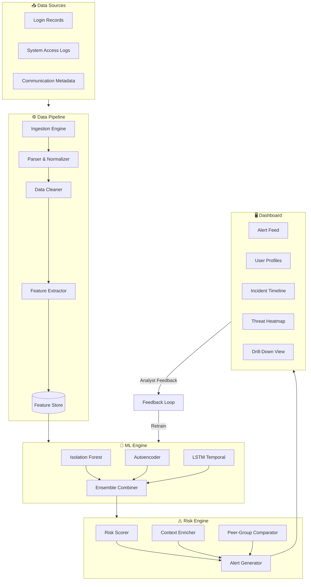
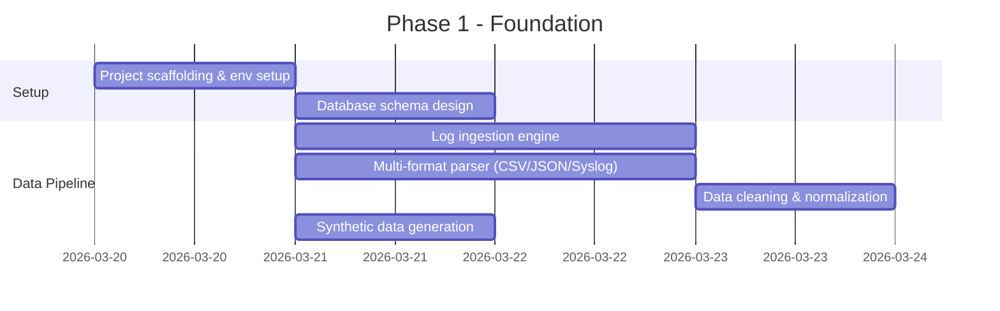
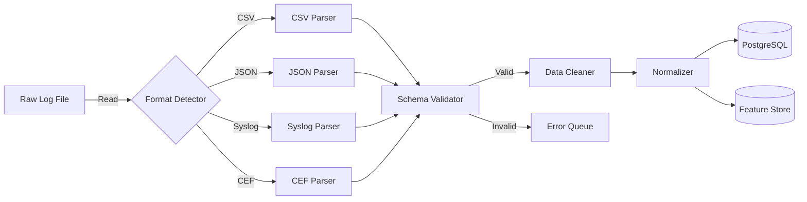
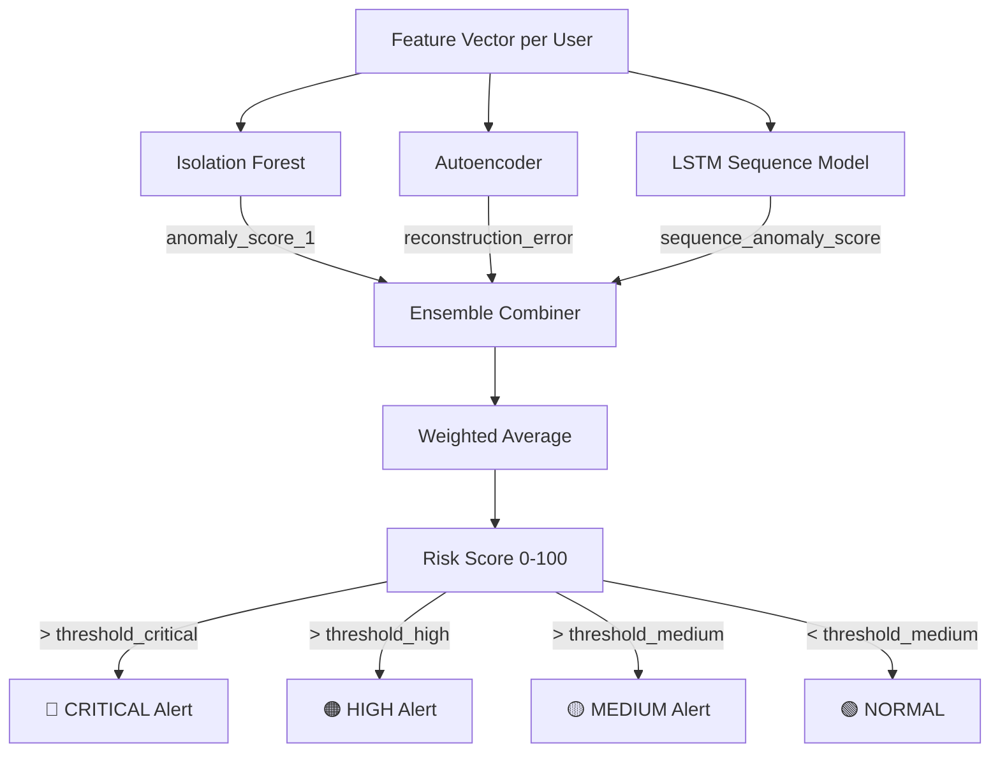
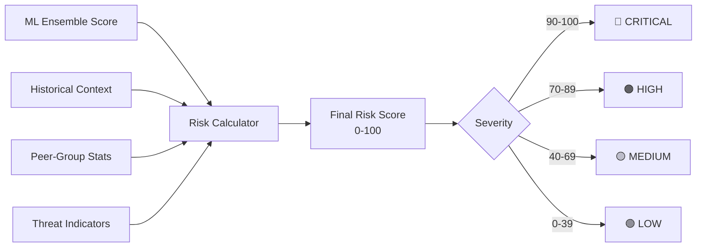
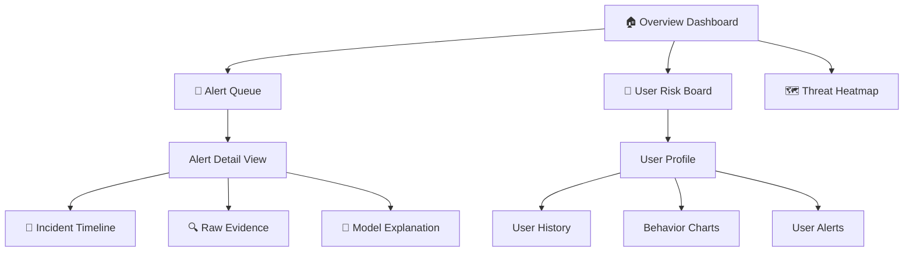
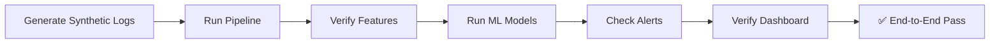

# 🗺️ AutonomusSOC — Project Flow Plan

> Detailed implementation roadmap for the Autonomous AI-Powered L1 SOC Agent

---

## 🔄 High-Level System Flow



---

## 📋 Phase-by-Phase Implementation Plan

---

### Phase 1: Foundation & Data Layer (Days 1–3)

**Goal:** Set up project infrastructure and build the data ingestion pipeline.



#### 1.1 Project Setup
- [x] Initialize Git repository
- [ ] Set up Python virtual environment with `requirements.txt`
- [ ] Configure project structure (as defined in README)
- [ ] Set up Docker & Docker Compose
- [ ] Configure environment variables (`.env`)
- [ ] Set up logging framework

#### 1.2 Data Schema Design
Define unified schemas for all log types:

```python
# Login Event Schema
{
    "event_id": "uuid",
    "timestamp": "ISO-8601",
    "user_id": "string",
    "event_type": "LOGIN_SUCCESS | LOGIN_FAILURE | LOGOUT",
    "source_ip": "string",
    "geo_location": {"lat": float, "lon": float, "country": "string"},
    "device_fingerprint": "string",
    "auth_method": "PASSWORD | MFA | SSO | CERTIFICATE",
    "session_duration": float,  # seconds
    "is_vpn": bool
}

# System Access Schema
{
    "event_id": "uuid",
    "timestamp": "ISO-8601",
    "user_id": "string",
    "resource_type": "FILE | DATABASE | APPLICATION | API | ADMIN_PANEL",
    "resource_id": "string",
    "action": "READ | WRITE | DELETE | EXECUTE | DOWNLOAD | UPLOAD",
    "privilege_level": "USER | ADMIN | SUPERADMIN",
    "data_volume_bytes": int,
    "is_first_access": bool
}

# Communication Schema
{
    "event_id": "uuid",
    "timestamp": "ISO-8601",
    "user_id": "string",
    "channel": "EMAIL | CHAT | FILE_SHARE",
    "direction": "SENT | RECEIVED",
    "recipient_domain": "INTERNAL | EXTERNAL",
    "recipient_count": int,
    "attachment_count": int,
    "attachment_size_bytes": int,
    "contains_sensitive_keywords": bool
}
```

#### 1.3 Synthetic Data Generator
Build a realistic data generator that simulates:
- **Normal users** — regular work patterns (9-5, consistent access)
- **Insider threat scenarios:**
  - 🔴 **Data exfiltration** — sudden spike in downloads/email attachments
  - 🔴 **Privilege abuse** — accessing resources beyond role
  - 🔴 **Account compromise** — login from new geo-locations, odd hours
  - 🔴 **Pre-resignation theft** — gradual increase in data access before exit
  - 🔴 **Reconnaissance** — scanning multiple systems/resources unusually

#### 1.4 Data Ingestion Pipeline



---

### Phase 2: Feature Engineering (Days 3–5)

**Goal:** Extract 50+ meaningful behavioral features from raw logs.

#### 2.1 Feature Categories

| Category | Features | Count |
|---|---|---|
| **Temporal** | Login hour distribution, session duration stats, day-of-week patterns, inter-login intervals, after-hours ratio | ~10 |
| **Access** | Unique resources/day, new resource rate, privilege escalation count, read/write ratio, data volume trends | ~12 |
| **Authentication** | Failed login rate, MFA bypass attempts, concurrent sessions, new device rate, IP diversity | ~8 |
| **Communication** | Email volume (sent/received), external recipient ratio, attachment frequency, large file transfers, new contact rate | ~10 |
| **Network** | Unique IPs, geo-diversity score, VPN usage changes, bandwidth consumption, connection timing | ~5 |
| **Behavioral** | Deviation from personal baseline, peer-group deviation, pattern change velocity, activity entropy | ~8 |

#### 2.2 Feature Engineering Pipeline

```python
# Feature Windows
FEATURE_WINDOWS = {
    "short":  "1h",    # Last 1 hour
    "medium": "24h",   # Last 24 hours
    "long":   "7d",    # Last 7 days
    "baseline": "30d"  # Rolling 30-day baseline
}

# Per-user, per-window feature computation
features = {
    # Temporal
    "login_count": count(logins, window),
    "login_hour_entropy": entropy(login_hours, window),
    "avg_session_duration": mean(session_durations, window),
    "after_hours_ratio": count(after_hours) / count(total),
    "weekend_activity_ratio": count(weekend) / count(total),
    
    # Access
    "unique_resources_accessed": nunique(resources, window),
    "new_resource_ratio": count(new_resources) / count(total_access),
    "data_download_volume": sum(download_bytes, window),
    "data_upload_volume": sum(upload_bytes, window),
    "privilege_escalation_count": count(escalations, window),
    
    # Communication
    "emails_sent": count(sent_emails, window),
    "external_recipient_ratio": count(external) / count(total_recipients),
    "avg_attachment_size": mean(attachment_sizes, window),
    "new_external_contacts": count(new_external, window),
    
    # Deviation
    "baseline_deviation_score": zscore(current, baseline),
    "peer_group_deviation": zscore(current, peer_group_stats),
}
```

#### 2.3 Feature Store Design
```
┌─────────────────────────────────────────┐
│              Feature Store              │
├─────────────────────────────────────────┤
│  user_id │ window │ feature_name │ value│
│──────────┼────────┼──────────────┼──────│
│  U001    │ 24h    │ login_count  │ 12   │
│  U001    │ 24h    │ login_entropy│ 2.3  │
│  U001    │ 7d     │ new_resource │ 0.45 │
│  ...     │ ...    │ ...          │ ...  │
└─────────────────────────────────────────┘
```

---

### Phase 3: ML Anomaly Detection Engine (Days 5–8)

**Goal:** Build and train multiple anomaly detection models.

#### 3.1 Model Architecture



#### 3.2 Model Details

**Model 1: Isolation Forest**
- Purpose: Detect point anomalies in high-dimensional feature space
- Input: Full feature vector (50+ features)
- Output: Anomaly score [-1, 1]
- Hyperparameters: `n_estimators=200, contamination=0.05, max_features=0.8`

**Model 2: Autoencoder (Deep Learning)**
```
Input (50 features)
    → Dense(128, ReLU)
    → Dropout(0.2)
    → Dense(64, ReLU)
    → Dense(32, ReLU)        ← Bottleneck
    → Dense(64, ReLU)
    → Dropout(0.2)
    → Dense(128, ReLU)
    → Dense(50, Sigmoid)
Output (Reconstructed features)

Anomaly Score = Reconstruction Error (MSE)
```

**Model 3: LSTM Temporal Detector**
- Purpose: Detect sequential anomalies over time windows
- Input: Sequence of feature vectors (last N time windows)
- Architecture: `LSTM(64) → LSTM(32) → Dense(16) → Dense(1, Sigmoid)`
- Captures: Unusual behavioral trajectories (gradual shifts)

**Model 4: Ensemble Combiner**
```python
risk_score = (
    w1 * normalize(isolation_forest_score) +
    w2 * normalize(autoencoder_error) +
    w3 * normalize(lstm_score)
) * 100

# Dynamic weights learned via validation
# Default: w1=0.35, w2=0.35, w3=0.30
```

#### 3.3 Training Strategy
1. Train on **normal behavior data** (majority class)
2. Validate using **injected threat scenarios** from synthetic data
3. Use **cross-validation** with time-based splits (no data leakage)
4. Threshold tuning via **precision-recall curve analysis**

---

### Phase 4: Risk Scoring & Alert Engine (Days 8–9)

**Goal:** Convert ML outputs into actionable, contextualized alerts.

#### 4.1 Risk Score Computation



#### 4.2 Alert Schema

```python
{
    "alert_id": "uuid",
    "timestamp": "ISO-8601",
    "user_id": "string",
    "user_name": "string",
    "department": "string",
    "risk_score": 87,
    "severity": "HIGH",
    "alert_type": "DATA_EXFILTRATION | PRIVILEGE_ABUSE | ANOMALOUS_ACCESS | ACCOUNT_COMPROMISE",
    "description": "User downloaded 2.3GB of sensitive files in 30 minutes, 15x above baseline",
    "contributing_factors": [
        {"factor": "download_volume", "current": "2.3GB", "baseline": "150MB", "deviation": "15.3σ"},
        {"factor": "after_hours_access", "current": true, "baseline_rate": 0.02},
        {"factor": "new_resources_accessed", "current": 23, "baseline": 3}
    ],
    "recommended_actions": [
        "Investigate file access logs for sensitive data categories",
        "Check if user has submitted resignation notice",
        "Review user's recent communication for external data sharing"
    ],
    "model_explanations": {
        "isolation_forest": 0.92,
        "autoencoder": 0.85,
        "lstm": 0.78
    }
}
```

#### 4.3 Contextual Enrichment
- Cross-reference with HR data (resignation status, performance reviews)
- Check against known threat patterns (MITRE ATT&CK Insider Threat)
- Historical alert correlation (escalating pattern detection)

---

### Phase 5: Interactive Dashboard (Days 9–12)

**Goal:** Build a SOC analyst-facing dashboard for monitoring and response.

#### 5.1 Dashboard Pages



#### 5.2 Page Specifications

**Page 1: Overview Dashboard**
- Total active alerts (by severity)
- Organization-wide risk score trend (line chart)
- Top 10 high-risk users (ranked list)
- Recent alert timeline (last 24h)
- Key metrics: MTTD, false positive rate, alerts/hour

**Page 2: Alert Queue**
- Sortable/filterable table of all alerts
- Columns: Severity, User, Type, Risk Score, Time, Status
- Quick actions: Acknowledge, Escalate, Dismiss, Investigate
- Bulk operations support

**Page 3: Alert Detail**
- Full alert context with contributing factors
- Model explanation visualizations (SHAP waterfall plots)
- Raw log evidence (clickable entries)
- Recommended response actions
- Similar past incidents

**Page 4: User Risk Profile**
- User info & department
- Current risk score gauge
- Behavioral feature charts (radar/spider chart)
- Activity timeline with anomaly highlights
- Historical risk score trend
- Peer-group comparison

**Page 5: Threat Heatmap**
- Organization-level view (by department/team)
- Color-coded risk levels
- Drill-down by time period
- Trend indicators (improving/worsening)

#### 5.3 Dashboard Tech

| Component | Technology |
|---|---|
| Framework | React 18 + Vite |
| Charting | Recharts / D3.js |
| State Mgmt | Zustand |
| Styling | Tailwind CSS |
| API Client | Axios / React Query |
| Real-time | WebSocket (for live alerts) |

---

### Phase 6: Integration & Testing (Days 12–14)

**Goal:** End-to-end system integration, testing, and optimization.

#### 6.1 Integration Testing



#### 6.2 Test Scenarios

| # | Scenario | Expected Outcome |
|---|---|---|
| 1 | Normal user behavior (30 days) | No alerts, risk score < 20 |
| 2 | Sudden data exfiltration (bulk download) | CRITICAL alert within 5 mins |
| 3 | Gradual privilege escalation over 2 weeks | HIGH alert with trend detection |
| 4 | Login from new country at 3 AM | HIGH alert for account compromise |
| 5 | Unusual email pattern (many external recipients) | MEDIUM alert for data sharing |
| 6 | Post-resignation increased access | CRITICAL alert with HR context |

#### 6.3 Performance Targets

| Metric | Target |
|---|---|
| Alert latency (log → alert) | < 30 seconds |
| Dashboard load time | < 2 seconds |
| ML inference time (per user) | < 100ms |
| False positive rate | < 15% |
| Detection rate (recall) | > 85% |

---

## 🔧 API Endpoints

```
GET    /api/v1/alerts              # List all alerts (with filters)
GET    /api/v1/alerts/{id}         # Get alert details
PATCH  /api/v1/alerts/{id}/status  # Update alert status
GET    /api/v1/users               # List all users with risk scores
GET    /api/v1/users/{id}          # Get user risk profile
GET    /api/v1/users/{id}/features # Get user feature history
GET    /api/v1/dashboard/overview  # Dashboard overview metrics
GET    /api/v1/dashboard/heatmap   # Organization threat heatmap
GET    /api/v1/models/status       # ML model health status
POST   /api/v1/pipeline/ingest     # Trigger log ingestion
WS     /ws/alerts                  # Real-time alert stream
```

---

## 🎯 Hackathon Deliverables Checklist

- [ ] Working data ingestion pipeline
- [ ] Feature engineering module (50+ features)
- [ ] Trained ML models (Isolation Forest + Autoencoder + LSTM)
- [ ] Risk scoring engine with explainability
- [ ] Interactive dashboard with all 5 pages
- [ ] End-to-end demo with synthetic threat scenarios
- [ ] Documentation & README
- [ ] Presentation / Demo video

---

## 📊 Success Criteria

```
✅ System ingests raw logs and processes them in real-time
✅ ML models detect at least 5 distinct insider threat patterns
✅ Dashboard displays actionable alerts with context
✅ Risk scores are explainable (analysts understand WHY)
✅ End-to-end latency < 30 seconds (log → alert)
✅ False positive rate < 15%
✅ System handles 10,000+ events/minute
```

---

<p align="center">
  <b>AutonomusSOC — Because the best defense is intelligent defense 🛡️</b>
</p>
