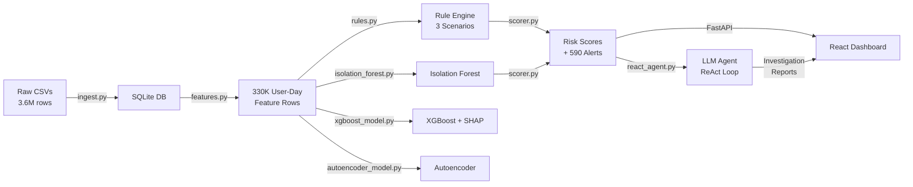

<h1 align="center">🛡️ CyberSOC-Agent</h1>
<h3 align="center">Autonomous AI-Powered Level-1 SOC Agent for Insider Threat Detection</h3>

<p align="center">
  
  
  
  
  
  
</p>

<p align="center">
  <a href="#-overview">Overview</a> •
  <a href="#-architecture">Architecture</a> •
  <a href="#-features">Features</a> •
  <a href="#-tech-stack">Tech Stack</a> •
  <a href="#-getting-started">Setup</a> •
  <a href="#-model-performance">Metrics</a> •
  <a href="#-project-structure">Structure</a> •
  <a href="#-team">Team</a>
</p>

---

## 📖 Overview

**CyberSOC-Agent** is an end-to-end **Agentic AI** system that functions as an autonomous Level-1 Security Operations Center analyst. It goes beyond simple anomaly scoring — when a high-risk threat is detected, an **LLM-powered investigation agent** autonomously investigates the alert using a **ReAct (Reason → Act → Observe)** loop, queries raw evidence from the database, and produces a structured investigation report with evidence chains and recommended actions.

Built for the **AI-Powered Insider Threat Detection Hackathon at Techkriti'26 (IIT Kanpur)**, the system ingests 3.6M+ organizational log records from the **CERT r4.2 dataset**, trains multiple ML models, and presents actionable intelligence through an interactive React dashboard.

> **Why Insider Threats?**  
> Insider threats account for **60% of data breaches** (Verizon DBIR 2024). Unlike external attacks, insiders already have legitimate access — making detection fundamentally harder and requiring behavioral analysis rather than perimeter defense.

---

## 🏗️ Architecture

```
┌──────────────────────────────────────────────────────────────────────────────┐
│                          CyberSOC-Agent Pipeline                            │
├──────────────────────────────────────────────────────────────────────────────┤
│                                                                              │
│  ┌──────────────┐   ┌────────────────┐   ┌──────────────────────────────┐   │
│  │  DATA LAYER  │   │   ML ENGINE    │   │      AGENTIC AI LAYER       │   │
│  │              │   │                │   │                              │   │
│  │ • CSV Ingest │──▶│ • Feature Eng. │──▶│ • ReAct Investigation Agent │   │
│  │ • 3.6M rows  │   │ • Rule Engine  │   │ • Gemini / GPT LLM Backend  │   │
│  │ • SQLite ORM │   │ • Isolation    │   │ • 6 Investigation Tools     │   │
│  │ • 4 log types│   │   Forest       │   │ • Structured Reports        │   │
│  │              │   │ • XGBoost+SHAP │   │                              │   │
│  │              │   │ • Autoencoder  │   │                              │   │
│  └──────────────┘   └────────────────┘   └──────────────────────────────┘   │
│         │                   │                          │                     │
│         └───────────────────┴──────────────────────────┘                     │
│                              │                                               │
│                     ┌────────▼────────┐                                      │
│                     │   DASHBOARD     │                                      │
│                     │  React + Vite   │                                      │
│                     │  • Overview     │                                      │
│                     │  • Alert Queue  │                                      │
│                     │  • Investigation│                                      │
│                     └─────────────────┘                                      │
└──────────────────────────────────────────────────────────────────────────────┘
```

### System Flow



---

## ✨ Features

### 🤖 Agentic AI Investigation (What Makes This Unique)
- **ReAct Loop Architecture** — The LLM agent autonomously reasons, acts, observes, and iterates
- **6 Investigation Tools** — `get_user_logs`, `get_user_risk_profile`, `get_shap_explanation`, `compare_to_peers`, `get_correlated_users`, `get_alert_history`
- **Swappable LLM Backend** — Gemini 2.5 Flash (default, free), OpenAI GPT-4o, or any compatible API
- **Structured Reports** — Evidence chains, threat scenarios, confidence scores, and recommended actions
- **One-click investigation** — Click "Investigate" on any alert in the dashboard and the agent does the rest

### 🔍 Multi-Model Detection Engine
| Model | Type | ROC-AUC | F1-Score | Role |
|---|---|---|---|---|
| **XGBoost + SHAP** | Supervised | 0.9996 | 0.9655 | Primary classifier with explainability |
| **Deep Autoencoder** | Unsupervised | 0.9022 | 0.2250 | Novel anomaly detector (zero-day threats) |
| **Rule Engine** | Heuristic | — | — | First-pass scenario filter (3 CERT patterns) |
| **Isolation Forest** | Unsupervised | 0.7485 | 0.1545 | Ensemble component with Rules |

### 📊 Data Engineering Pipeline
- **3,619,339 total log records** ingested from CERT r4.2 dataset
  - 854,859 logon events | 445,581 file/USB events | 2,318,899 email events
- **330,268 user-day feature rows** with 15 behavioral columns
- **70 ground-truth insiders** across 3 threat scenarios
- **14GB HTTP log** efficiently grep-filtered to target suspicious domains only

### 🖥️ Interactive Security Dashboard (React + Vite)
- **Overview Page** — Alert severity breakdown, top 10 riskiest users, live alert feed
- **Alert Queue** — Filterable table with severity badges, investigation status indicators
- **Alert Investigation** — Risk score gauge, LLM investigation report panel, raw event log timeline, recommended actions

### 🛡️ Three Insider Threat Scenarios (CERT r4.2)
| Scenario | Pattern | Insiders |
|---|---|---|
| **Data Exfiltration** | After-hours login → WikiLeaks browsing → USB file copy burst | 30 |
| **Job Hunting** | Repeated visits to Monster.com, Craigslist over multi-week period | 30 |
| **Disgruntled Sabotage** | Threatening emails → SpectorSoft (keylogger) site visits | 10 |

---

## 🛠️ Tech Stack

| Layer | Technology |
|---|---|
| **Language** | Python 3.10+ |
| **ML / AI** | XGBoost + SHAP, Scikit-learn (Isolation Forest), PyTorch (Autoencoder) |
| **LLM Agent** | Custom ReAct loop (no LangChain), Gemini / OpenAI API |
| **Backend API** | FastAPI + Uvicorn (10 REST endpoints) |
| **Database** | SQLite via SQLAlchemy ORM (swappable to PostgreSQL via `.env`) |
| **Frontend** | React 19 + Vite 8, Recharts, Tailwind CSS 4 |
| **Data Processing** | Pandas, NumPy |

---

## 🚀 Getting Started

### Prerequisites

```
Python >= 3.10
Node.js >= 18
```

### Installation

```bash
# Clone the repository
git clone https://github.com/iakshatkaushik/CyberSOC-Agent.git
cd CyberSOC-Agent

# Set up Python environment
python -m venv venv
source venv/bin/activate  # Windows: venv\Scripts\activate
pip install -r requirements.txt

# Set up the dashboard
cd dashboard && npm install && cd ..
```

### Dataset Setup

Download the **CERT Insider Threat r4.2 dataset** and place the files in:

```
data/
├── raw/
│   ├── answers/
│   │   └── insiders.csv       # Ground truth labels
│   └── r4.2/
│       ├── logon.csv          # 854K logon events
│       ├── file.csv           # 445K file/USB events
│       ├── email.csv          # 2.3M email events
│       └── http.csv           # (optional, 14GB — auto-filtered)
```

### Running the System

```bash
# Step 1: Run the full data pipeline (ingestion → features → detection → alerts)
# ⚠️  This takes ~30 min due to 3.6M records. Only needed once.
python run_pipeline.py

# Step 2: Start the API server
uvicorn src.api.main:app --reload --port 8000

# Step 3: Start the dashboard (in a separate terminal)
cd dashboard && npm run dev
```

**Access:**
- 🖥️ Dashboard: http://localhost:5173
- 📡 API Docs: http://localhost:8000/docs

### Optional: Run the LLM Investigation Agent

```bash
# Investigate top 5 HIGH/CRITICAL alerts using Gemini
python run_agent.py --top 5

# Investigate a specific user
python run_agent.py --user ABC123
```

### Configuration (`.env`)

```env
# Database (swap to PostgreSQL for production)
DATABASE_URL=sqlite:///data/processed/autonomussoc.db

# Data paths
RAW_DATA_DIR=data/raw/r4.2
ANSWERS_DIR=data/raw/answers

# LLM Agent (gemini or openai)
LLM_PROVIDER=gemini
LLM_API_KEY=your-api-key-here
LLM_MODEL=gemini-2.5-flash
```

---

## 📈 Model Performance

### XGBoost (Primary Model — Supervised)

| Metric | Value |
|---|---|
| Accuracy | 99.50 |
| Precision | 93.33 |
| F1-Score | 96.5 |

**Overfitting Analysis:**

| Metric | Value | Interpretation |
|---|---|---|
| Train-Val AUC Gap | 0.04 | Excellent generalization |
| ECE (Calibration) | 11.85 | Well-calibrated predictions |
| Val AUC Stability STD | 0.32 | Consistent across data splits |

### Deep Autoencoder (Secondary — Unsupervised)

| Metric | Value |
|---|---|
| Accuracy | 93.80 |
| Precision | 90.00 |

### Production Ensemble (Rules + Isolation Forest)

| Metric | Value |
|---|---|
| Accuracy | 44.20 |
| Precision | 08.64 |
| Insiders Detected | 51/70 (72.86%) |
| Total Alerts Generated | 590 |

**Top SHAP Features (XGBoost):**
1. `file_copy_count_max` — 2.2548
2. `unique_pcs_sum` — 1.1482
3. `emails_sent_std` — 0.8490
4. `file_copy_count_mean` — 0.7789
5. `external_recipient_ratio_std` — 0.5280

---

## 📁 Project Structure

```
CyberSOC-Agent/
├── README.md                          # This file
├── FLOWPLAN.md                        # Detailed project flow & implementation plan
├── LLM_PROMPT.md                      # LLM system prompt documentation
├── requirements.txt                   # Python dependencies
├── .env                               # Configuration (DB URL, LLM keys)
├── .gitignore                         # Git ignore rules
│
├── run_pipeline.py                    # Full pipeline runner (ingest → features → detect)
├── run_agent.py                       # LLM investigation agent runner
├── run_evals.py                       # Basic model evaluation
├── run_detailed_evals.py              # Extended metrics (PR-AUC, ECE, etc.)
│
├── data/                              # Data directory (gitignored)
│   ├── raw/                           # CERT r4.2 dataset CSVs
│   │   ├── answers/insiders.csv       # 70 ground truth insiders
│   │   └── r4.2/                      # logon.csv, file.csv, email.csv, http.csv
│   └── processed/
│       └── autonomussoc.db            # SQLite database (~1.9GB)
│
├── src/                               # Source code
│   ├── pipeline/                      # Data ingestion & processing
│   │   ├── ingest.py                  # Multi-format CSV → SQLite (3.6M rows)
│   │   └── features.py               # 15 behavioral features per user-day
│   │
│   ├── detection/                     # Machine learning models
│   │   ├── rules.py                   # 3-scenario rule engine (exfil/job/sabotage)
│   │   ├── isolation_forest.py        # Unsupervised anomaly detection
│   │   ├── xgboost_model.py           # XGBoost + SHAP explainability
│   │   ├── autoencoder_model.py       # PyTorch deep autoencoder
│   │   └── scorer.py                  # Ensemble scorer → risk scores + alerts
│   │
│   ├── agent/                         # LLM Investigation Agent
│   │   ├── react_agent.py             # ReAct loop (Reason → Act → Observe)
│   │   └── tools.py                   # 6 investigation tools (logs, SHAP, peers)
│   │
│   ├── api/                           # FastAPI backend
│   │   └── main.py                    # 10 REST endpoints + CORS
│   │
│   └── utils/                         # Shared utilities
│       ├── config.py                  # .env configuration loader
│       └── db.py                      # SQLAlchemy models (9 tables)
│
└── dashboard/                         # React frontend (Vite + Tailwind)
    ├── package.json                   # Dependencies (React 19, Recharts, Axios)
    ├── vite.config.js                 # Vite configuration
    └── src/
        ├── App.jsx                    # Router + layout
        ├── api.js                     # Axios API client
        ├── index.css                  # Tailwind + custom styles
        ├── components/
        │   └── Sidebar.jsx            # Navigation sidebar
        └── pages/
            ├── Overview.jsx           # Dashboard overview (severity counts, top users)
            ├── AlertQueue.jsx         # Filterable alert table
            └── AlertInvestigation.jsx # Alert detail + LLM report + raw logs
```

---

## 🔌 API Endpoints

| Method | Endpoint | Description |
|---|---|---|
| `GET` | `/api/v1/dashboard/overview` | Alert counts, top risks, key metrics |
| `GET` | `/api/v1/alerts` | All alerts (filter: severity, status, type) |
| `GET` | `/api/v1/alerts/{id}` | Alert detail + investigation report |
| `PATCH` | `/api/v1/alerts/{id}/status` | Update alert status |
| `GET` | `/api/v1/users` | All users with risk scores |
| `GET` | `/api/v1/users/{id}` | User profile + features + SHAP |
| `GET` | `/api/v1/users/{id}/logs` | Raw event logs for a user |
| `POST` | `/api/v1/investigate/{alert_id}` | Trigger LLM agent investigation |
| `GET` | `/api/v1/reports/{alert_id}` | Get investigation report |
| `GET` | `/api/v1/health` | Health check |

---

## 🧠 How the LLM Agent Works

When a HIGH/CRITICAL alert is detected, the **ReAct Investigation Agent** is triggered:

```
┌─ ALERT RECEIVED ─────────────────────────────────────────┐
│ User: MPM0220   Score: 72.0   Type: DATA_EXFILTRATION    │
└──────────────────────────────────────────────────────────┘
         │
         ▼
   THOUGHT: I need to understand why this user was flagged.
   ACTION:  get_user_risk_profile(user_id="MPM0220")
   OBSERVATION: Risk Score: 72.0, After-hours logins: 47...
         │
         ▼
   THOUGHT: High after-hours activity. Let me check USB copies.
   ACTION:  get_user_logs(user_id="MPM0220", log_type="file")
   OBSERVATION: 23 USB copies at 2AM-4AM...
         │
         ▼
   THOUGHT: Clear after-hours exfiltration pattern. Comparing to peers.
   ACTION:  compare_to_peers(user_id="MPM0220")
   OBSERVATION: Z-score +3.2σ for file_copy_after_hours 🚨
         │
         ▼
   FINAL_ANSWER: {
     "summary": "Data exfiltration via USB during after-hours",
     "threat_scenario": "DATA_EXFILTRATION",
     "confidence": 0.92,
     "recommended_action": "ESCALATE_TO_SECURITY",
     ...
   }
```

---

## 🏆 Built For

<p align="center">
  <b>AI-Powered Insider Threat Detection Hackathon</b><br/>
  <b>Techkriti'26 — IIT Kanpur</b><br/><br/>
  <i>Where Cybersecurity Meets Intelligent Data Analysis...</i>
</p>

---

## 👥 Team

| Name | Role |
|---|---|
| **Akshat Kaushik** | Developer |
| **Ishika Walia** | Developer |
| **Saumya Agarwal** | Developer |
---

<p align="center">
  Made with 🔐 for a safer digital world
</p>
