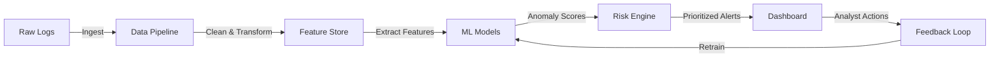

<p align="center">
  
</p>

<h1 align="center">🛡️ AutonomusSOC</h1>
<h3 align="center">Autonomous AI-Powered Level-1 SOC Agent for Insider Threat Detection</h3>

<p align="center">
  
  
  
  
  
</p>

<p align="center">
  <a href="#-overview">Overview</a> •
  <a href="#-problem-statement">Problem</a> •
  <a href="#-architecture">Architecture</a> •
  <a href="#-features">Features</a> •
  <a href="#-tech-stack">Tech Stack</a> •
  <a href="#-getting-started">Setup</a> •
  <a href="#-project-structure">Structure</a> •
  <a href="#-team">Team</a>
</p>

---

## 📖 Overview

**AutonomusSOC** is an end-to-end AI-driven system that acts as an **autonomous Level-1 Security Operations Center (SOC) analyst**. It continuously monitors an organization's digital footprint — login records, system access patterns, and communication metadata — to detect insider threats in real-time.

Built for the **AI-Powered Insider Threat Detection Hackathon at Techkriti'26 (IIT Kanpur)**, this system combines advanced machine learning, robust data engineering, and an interactive security dashboard to identify, score, and alert on anomalous user behavior.

> **Why Insider Threats?**  
> Insider threats account for **60% of data breaches** (Verizon DBIR 2024). Unlike external attacks, insiders already have legitimate access — making detection fundamentally harder and requiring behavioral analysis rather than perimeter defense.

---

## 🎯 Problem Statement

Design and develop an AI-driven system capable of identifying suspicious activities within an organization by analyzing:

| Data Source | Description |
|---|---|
| 🔐 **Login Records** | Authentication events — timestamps, IP addresses, success/failure, geo-location, device fingerprints |
| 💻 **System Access Patterns** | File access, privilege usage, resource interactions, application usage, data transfer volumes |
| 📧 **Communication Data** | Email metadata, messaging patterns, recipient analysis, attachment behavior, data exfiltration signals |

The system must process raw log data into meaningful insights and present actionable alerts through an interactive dashboard.

---

## 🏗️ Architecture

```
┌──────────────────────────────────────────────────────────────────────┐
│                        AutonomusSOC Pipeline                         │
├──────────────────────────────────────────────────────────────────────┤
│                                                                      │
│  ┌─────────────┐    ┌──────────────┐    ┌─────────────────────────┐  │
│  │  DATA LAYER │    │  ML ENGINE   │    │     DASHBOARD LAYER     │  │
│  │             │    │              │    │                         │  │
│  │ • Log       │───▶│ • Feature    │───▶│ • Real-time Alerts      │  │
│  │   Ingestion │    │   Engineering│    │ • Risk Scorecards       │  │
│  │ • Parsing   │    │ • Anomaly    │    │ • User Profiles         │  │
│  │ • Cleaning  │    │   Detection  │    │ • Incident Timeline     │  │
│  │ • Storage   │    │ • Risk       │    │ • Drill-down Analysis   │  │
│  │             │    │   Scoring    │    │ • Threat Intelligence   │  │
│  └─────────────┘    └──────────────┘    └─────────────────────────┘  │
│         │                  │                        │                 │
│         └──────────────────┴────────────────────────┘                 │
│                            │                                         │
│                    ┌───────▼───────┐                                  │
│                    │  ALERT ENGINE │                                  │
│                    │  • Severity   │                                  │
│                    │  • Context    │                                  │
│                    │  • Playbooks  │                                  │
│                    └───────────────┘                                  │
└──────────────────────────────────────────────────────────────────────┘
```

### System Flow



---

## ✨ Features

### 🔍 Intelligent Detection Engine
- **Multi-model anomaly detection** — Isolation Forest, Autoencoders, LSTM for temporal patterns
- **User behavior profiling** — builds per-user baselines and detects deviations
- **Peer-group analysis** — compares user behavior against role-based cohorts
- **Composite risk scoring** — multi-dimensional threat scores with explainability

### 📊 Data Engineering Pipeline
- **Multi-format log ingestion** — CSV, JSON, Syslog, CEF formats
- **Real-time stream processing** — handles continuous log streams
- **Feature engineering** — 50+ behavioral features extracted automatically
- **Data normalization** — consistent schemas across diverse log sources

### 🖥️ Interactive Security Dashboard
- **Real-time alert feed** — prioritized by severity with contextual details
- **User risk profiles** — comprehensive view of each user's threat score and history
- **Incident timeline** — visual reconstruction of suspicious activity chains
- **Drill-down analytics** — click into any alert to see raw evidence and model explanations
- **Threat heatmaps** — organizational-level risk visualization

### 🤖 Autonomous SOC Capabilities
- **Auto-triage** — classifies and prioritizes alerts like a L1 SOC analyst
- **Contextual enrichment** — augments alerts with historical context and threat intelligence
- **Recommended actions** — suggests response playbooks for each alert type
- **False positive reduction** — learns from analyst feedback to reduce noise

---

## 🛠️ Tech Stack

| Layer | Technology |
|---|---|
| **Language** | Python 3.10+ |
| **ML/AI** | Scikit-learn, PyTorch, XGBoost |
| **Data Processing** | Pandas, NumPy, Apache Kafka (streaming) |
| **Backend API** | FastAPI |
| **Dashboard** | React.js + D3.js / Recharts |
| **Database** | PostgreSQL (structured), Redis (cache/real-time) |
| **Containerization** | Docker, Docker Compose |
| **Visualization** | Plotly, Matplotlib (reports) |

---

## 🚀 Getting Started

### Prerequisites

```bash
Python >= 3.10
Node.js >= 18
Docker & Docker Compose (optional)
```

### Installation

```bash
# Clone the repository
git clone https://github.com/YOUR_USERNAME/AutonomusSOC.git
cd AutonomusSOC

# Set up Python environment
python -m venv venv
source venv/bin/activate  # Windows: venv\Scripts\activate

# Install dependencies
pip install -r requirements.txt

# Set up the dashboard
cd dashboard
npm install
cd ..
```

### Running the System

```bash
# Start the data pipeline
python -m src.pipeline.ingest

# Start the ML engine
python -m src.ml.engine

# Start the API server
uvicorn src.api.main:app --reload --port 8000

# Start the dashboard (in a separate terminal)
cd dashboard && npm run dev
```

### Using Docker

```bash
docker-compose up --build
```

---

## 📁 Project Structure

```
AutonomusSOC/
├── README.md                   # This file
├── FLOWPLAN.md                 # Detailed project flow & implementation plan
├── requirements.txt            # Python dependencies
├── docker-compose.yml          # Container orchestration
├── .env.example                # Environment variables template
│
├── data/                       # Data directory
│   ├── raw/                    # Raw log files
│   ├── processed/              # Cleaned & transformed data
│   └── synthetic/              # Generated test data
│
├── src/                        # Source code
│   ├── pipeline/               # Data ingestion & processing
│   │   ├── ingest.py           # Log ingestion engine
│   │   ├── parser.py           # Multi-format log parser
│   │   ├── cleaner.py          # Data cleaning & normalization
│   │   └── features.py         # Feature engineering
│   │
│   ├── ml/                     # Machine learning models
│   │   ├── engine.py           # ML orchestration engine
│   │   ├── models/             # Model implementations
│   │   │   ├── isolation_forest.py
│   │   │   ├── autoencoder.py
│   │   │   ├── lstm_detector.py
│   │   │   └── ensemble.py
│   │   ├── scoring.py          # Risk scoring module
│   │   └── explainer.py        # Model explainability (SHAP/LIME)
│   │
│   ├── api/                    # FastAPI backend
│   │   ├── main.py             # API entry point
│   │   ├── routes/             # API routes
│   │   └── schemas/            # Pydantic models
│   │
│   └── utils/                  # Shared utilities
│       ├── config.py           # Configuration management
│       ├── logger.py           # Logging setup
│       └── db.py               # Database connections
│
├── dashboard/                  # React frontend
│   ├── src/
│   │   ├── components/         # UI components
│   │   ├── pages/              # Dashboard pages
│   │   └── services/           # API integration
│   └── package.json
│
├── notebooks/                  # Jupyter notebooks for EDA & prototyping
│   ├── 01_data_exploration.ipynb
│   ├── 02_feature_engineering.ipynb
│   └── 03_model_experiments.ipynb
│
├── tests/                      # Test suite
│   ├── test_pipeline.py
│   ├── test_models.py
│   └── test_api.py
│
└── assets/                     # Images, diagrams, etc.
    └── banner.png
```

---

## 📈 How It Works

### 1. Data Ingestion
Raw organizational logs (login events, system access, communication metadata) are ingested and parsed into a unified schema.

### 2. Feature Engineering
50+ behavioral features are extracted per user per time window:
- **Temporal** — login hour distribution, session duration, frequency changes
- **Access** — unique systems accessed, privilege escalation events, new resource access
- **Communication** — email volume shifts, new external recipients, large attachment patterns
- **Network** — IP geolocation changes, VPN usage patterns, concurrent sessions

### 3. Anomaly Detection
Multiple ML models analyze user behavior:
- **Isolation Forest** — detects point anomalies in high-dimensional feature space
- **Autoencoder** — learns compressed representations; high reconstruction error = anomaly
- **LSTM** — captures temporal sequence anomalies (unusual patterns over time)
- **Ensemble** — combines model outputs for robust, high-confidence detection

### 4. Risk Scoring & Alerting
Each user receives a dynamic **risk score (0–100)** based on:
- Individual anomaly scores across all models
- Historical behavior deviation magnitude
- Contextual threat indicators (e.g., resignation notice + data download)
- Peer-group comparison

### 5. Interactive Dashboard
SOC analysts interact with a real-time dashboard showing:
- Prioritized alert queue with severity levels (Critical / High / Medium / Low)
- User risk profiles with behavioral timelines
- Incident drill-downs with raw evidence and model explanations
- Organization-wide threat heatmap

---

## 🧪 Evaluation Metrics

| Metric | Description |
|---|---|
| **Detection Rate (Recall)** | % of actual threats correctly identified |
| **Precision** | % of alerts that are true threats (vs false positives) |
| **F1-Score** | Harmonic mean of precision and recall |
| **AUC-ROC** | Model discrimination ability |
| **Mean Time to Detect (MTTD)** | Average time from threat action to alert |
| **False Positive Rate** | % of benign activities incorrectly flagged |

---

## 🏆 Built For

<p align="center">
  <b>AI-Powered Insider Threat Detection Hackathon</b><br/>
  <b>Techkriti'26 — IIT Kanpur</b><br/><br/>
  <i>Where Cybersecurity Meets Intelligent Data Analysis</i>
</p>

---

## 👥 Team

| Name | Role |
|---|---|
| **Akshat Kaushik** | Lead Developer |

---

## 📄 License

This project is licensed under the MIT License — see the [LICENSE](LICENSE) file for details.

---

<p align="center">
  Made with 🔐 for a safer digital world
</p>
